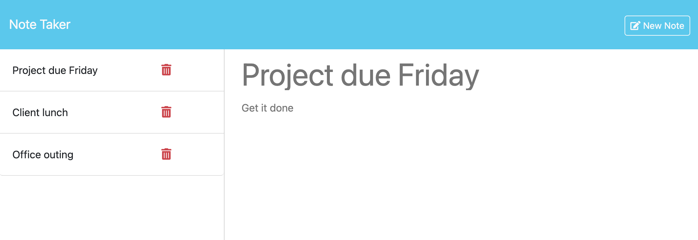

# Note Taker

## Description

The purpose of this project was to create an application called Note Taker that can be used to write and save notes. This application uses an Express.js back end and will save and retrieve note data from a JSON file.

## Installation

The project can be found at the following GitHub Page: https://github.com/j-preim/note-taker

## Usage

The website will appear as it does in the following screenshot:

## Credits

Starter code was used from the provided repository.

## License

Copyright (c) 2023 Joe Preimesberger

Licensed under the MIT license.